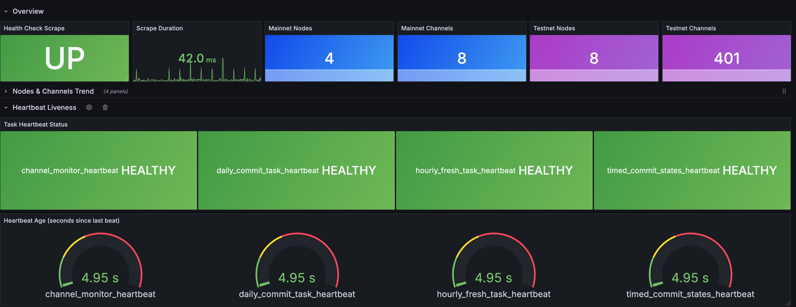

# fiber-dashboard-exporter

Prometheus exporter for the [Fiber Dashboard](https://github.com/cryptape/fiber-dashboard) backend.

Polls the `/health_check` and `/analysis_hourly` endpoints and exposes
heartbeat timestamps, total node counts, and total channel counts as
Prometheus metrics — with **mainnet / testnet** breakdown.

## Metrics

### Health check (heartbeat liveness)

| Metric | Type | Labels | Description |
|---|---|---|---|
| `fiber_dashboard_heartbeat_timestamp_seconds` | Gauge | `task` | Unix timestamp of the last heartbeat |
| `fiber_dashboard_heartbeat_age_seconds` | Gauge | `task` | Seconds elapsed since the last heartbeat |
| `fiber_dashboard_heartbeat_healthy` | Gauge | `task` | `1` if fresh, `0` if stale |
| `fiber_dashboard_scrape_success` | Gauge | — | `1` if the last /health_check scrape succeeded |
| `fiber_dashboard_scrape_duration_seconds` | Gauge | — | Duration of the last /health_check scrape |

The `task` label takes one of:

- `timed_commit_states_heartbeat` — fetches node/channel graphs from Fiber RPC (every 30 min)
- `daily_commit_task_heartbeat` — daily statistics aggregation (daily at 00:11 UTC)
- `hourly_fresh_task_heartbeat` — refreshes materialized views (every 5 min)
- `channel_monitor_heartbeat` — monitors on-chain channel states

### Network statistics (nodes & channels)

| Metric | Type | Labels | Description |
|---|---|---|---|
| `fiber_dashboard_total_nodes` | Gauge | `network` | Total active nodes |
| `fiber_dashboard_total_channels` | Gauge | `network` | Total active channels |
| `fiber_dashboard_network_scrape_success` | Gauge | `network` | `1` if the last /analysis_hourly scrape succeeded |

The `network` label is `mainnet` or `testnet`.

### Meta

| Metric | Type | Description |
|---|---|---|
| `fiber_dashboard_exporter_info` | Info | Build metadata (version, target URL, networks) |

## Quick Start

### Run directly

```bash
pip install -r requirements.txt

# Monitor both mainnet and testnet (default)
python exporter.py --target-url http://localhost:8080

# Monitor only mainnet
python exporter.py --target-url http://localhost:8080 --networks mainnet

# Monitor only testnet
python exporter.py --target-url http://localhost:8080 --networks testnet
```

Metrics are now available at `http://localhost:9101/metrics`.

### Run with Docker

```bash
docker build -t fiber-dashboard-exporter .

docker run -d \
  --name fiber-dashboard-exporter \
  -p 9101:9101 \
  fiber-dashboard-exporter \
  --target-url http://host.docker.internal:8080
```

### Run alongside Fiber Dashboard (Docker Compose)

Add the exporter service to the existing Fiber Dashboard `compose.yaml`:

```yaml
services:
  # ... existing timescaledb and fiber-dashbord services ...

  fiber-dashboard-exporter:
    build:
      context: ./fiber-dashboard-exporter
      dockerfile: Dockerfile
    container_name: fiber-dashboard-exporter
    ports:
      - "9101:9101"
    command:
      - "--target-url=http://fiber-dashbord-backend:8080"
      - "--networks=mainnet,testnet"
      - "--scrape-interval=15"
      - "--stale-threshold=120"
    networks:
      - fiber-network
    depends_on:
      - fiber-dashbord
    restart: always
```

## CLI Options

```
usage: exporter.py [-h] --target-url TARGET_URL
                   [--networks NETWORKS]
                   [--listen-port LISTEN_PORT]
                   [--scrape-interval SCRAPE_INTERVAL]
                   [--request-timeout REQUEST_TIMEOUT]
                   [--stale-threshold STALE_THRESHOLD]
                   [--log-level {DEBUG,INFO,WARNING,ERROR}]

options:
  --target-url          Base URL of the Fiber Dashboard backend (required)
                        e.g. http://localhost:8080
                        (also accepts http://localhost:8080/health_check)
  --networks            Comma-separated networks to monitor (default: mainnet,testnet)
  --listen-port         Port for the Prometheus metrics server (default: 9101)
  --scrape-interval     Seconds between scrapes (default: 15)
  --request-timeout     HTTP request timeout in seconds (default: 5)
  --stale-threshold     Seconds after which a heartbeat is marked stale (default: 120)
  --log-level           Logging level (default: INFO)
```

## Prometheus Configuration

Add a scrape job to your `prometheus.yml`:

```yaml
scrape_configs:
  - job_name: fiber_dashboard
    static_configs:
      - targets:
          - "localhost:9101"
        labels:
          env: prod
```

## Alert Rules

An example alerting rules file is provided in [`alerts.yml`](alerts.yml):

```yaml
groups:
  - name: fiber_dashboard
    rules:
      - alert: FiberDashboardScrapeDown
        expr: fiber_dashboard_scrape_success == 0
        for: 2m
        labels:
          severity: critical

      - alert: FiberDashboardTaskStale
        expr: fiber_dashboard_heartbeat_healthy == 0
        for: 5m
        labels:
          severity: warning

      - alert: FiberDashboardNoNodes
        expr: fiber_dashboard_total_nodes == 0
        for: 10m
        labels:
          severity: critical
        annotations:
          summary: "No active nodes on {{ $labels.network }}"

      - alert: FiberDashboardNoChannels
        expr: fiber_dashboard_total_channels == 0
        for: 10m
        labels:
          severity: critical
        annotations:
          summary: "No active channels on {{ $labels.network }}"
```

## Example /metrics Output

```
# HELP fiber_dashboard_heartbeat_timestamp_seconds Unix timestamp of the last heartbeat
# TYPE fiber_dashboard_heartbeat_timestamp_seconds gauge
fiber_dashboard_heartbeat_timestamp_seconds{task="timed_commit_states_heartbeat"} 1.738857600e+09
fiber_dashboard_heartbeat_timestamp_seconds{task="daily_commit_task_heartbeat"} 1.738857600e+09
fiber_dashboard_heartbeat_timestamp_seconds{task="hourly_fresh_task_heartbeat"} 1.738857600e+09
fiber_dashboard_heartbeat_timestamp_seconds{task="channel_monitor_heartbeat"} 1.738857540e+09

# HELP fiber_dashboard_total_nodes Total number of active nodes
# TYPE fiber_dashboard_total_nodes gauge
fiber_dashboard_total_nodes{network="mainnet"} 42.0
fiber_dashboard_total_nodes{network="testnet"} 15.0

# HELP fiber_dashboard_total_channels Total number of active channels
# TYPE fiber_dashboard_total_channels gauge
fiber_dashboard_total_channels{network="mainnet"} 128.0
fiber_dashboard_total_channels{network="testnet"} 37.0
```

## How It Works

```
                         GET /health_check
┌──────────────┐    GET /analysis_hourly?net=mainnet    ┌──────────────────┐
│              │    GET /analysis_hourly?net=testnet     │                  │
│   Exporter   │ ────────────────────────────────────>  │  Fiber Dashboard │
│  :9101       │ <────────────────────────────────────  │  Backend :8080   │
│              │         JSON responses                  │                  │
└──────────────┘                                        └──────────────────┘
       │
       │  GET /metrics
       v
┌──────────────┐
│  Prometheus  │
└──────────────┘
       │
       v
┌──────────────┐
│   Grafana    │
│  (optional)  │
└──────────────┘
```

## Import Grafana



## License

MIT
